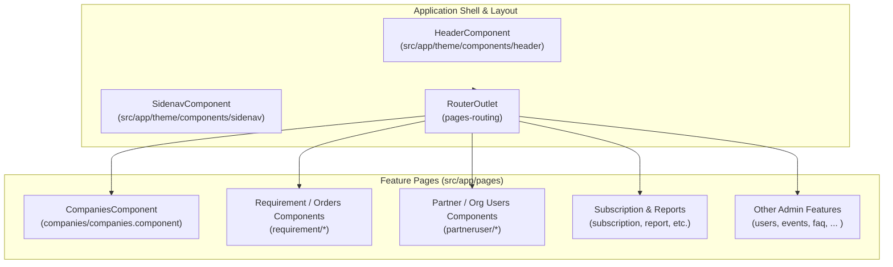
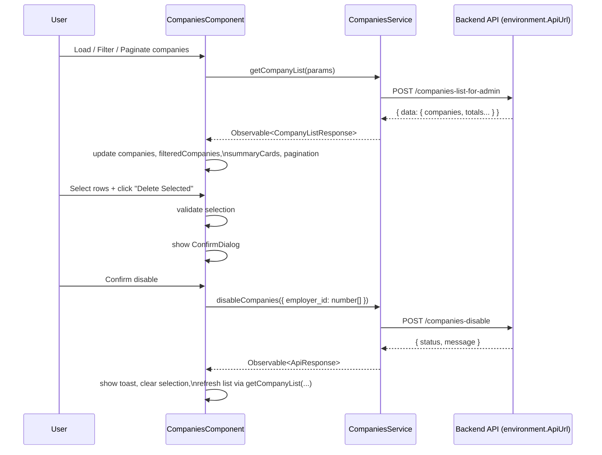
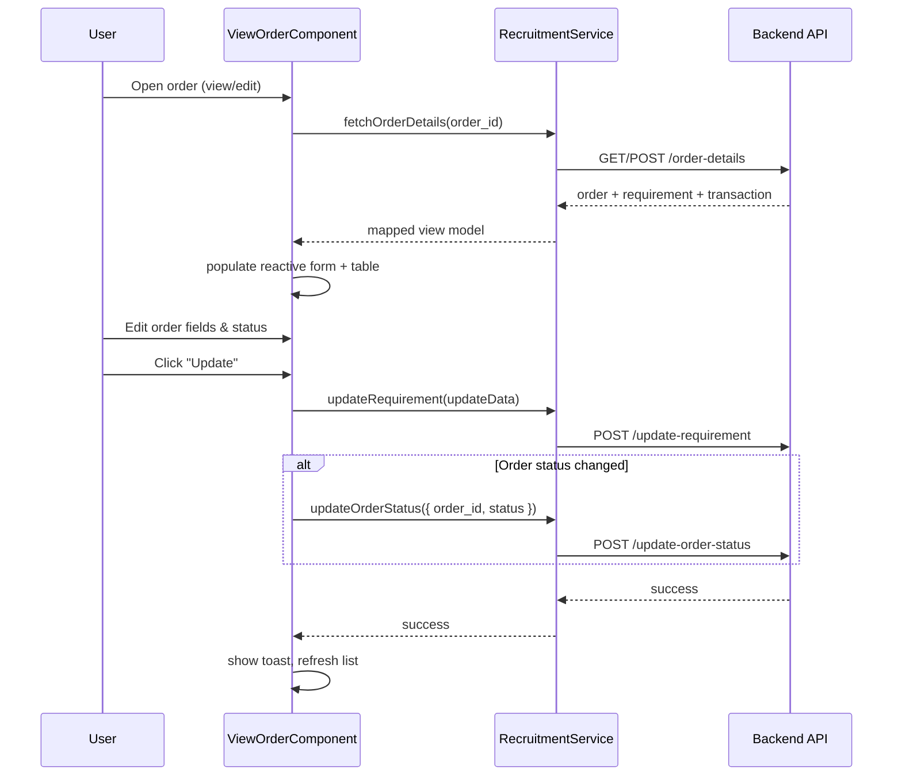
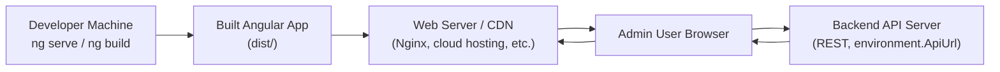
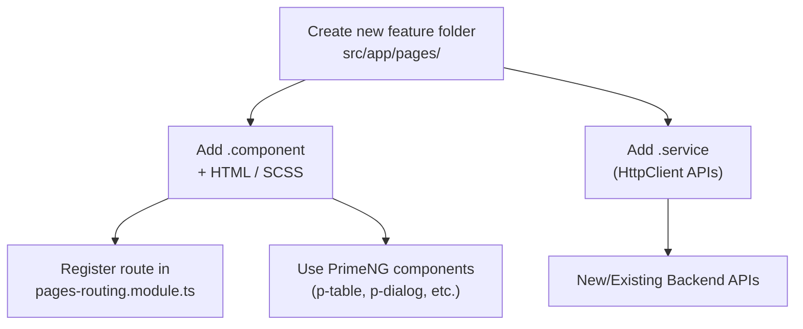

## UNIPREP Admin – Architecture Diagrams

> These diagrams are intentionally high‑level and front‑end–focused. They describe how the Angular admin app is structured and how it talks to the backend APIs.

---

### 1. Logical Component Architecture

**Explanation**

- The app uses a **single layout** (header + sidenav + router outlet).
- The router loads **feature components** under `src/app/pages` lazily.

---

### 2. Companies Feature – Data Flow

---

### 3. Requirement / Order – Simplified Flow

---

### 4. Deployment / Runtime View (Front‑End Focused)

**Notes**

- The Angular app is compiled into static assets (`dist/`).
- A web server (or CDN + origin) serves the SPA.
- The SPA talks to the backend via `environment.ApiUrl` over HTTPS.

---

### 5. Extending the Architecture

When adding a new feature:

This keeps the architecture **feature‑oriented**, consistent with existing pages like `companies`, `requirement`, `partneruser`, etc.

